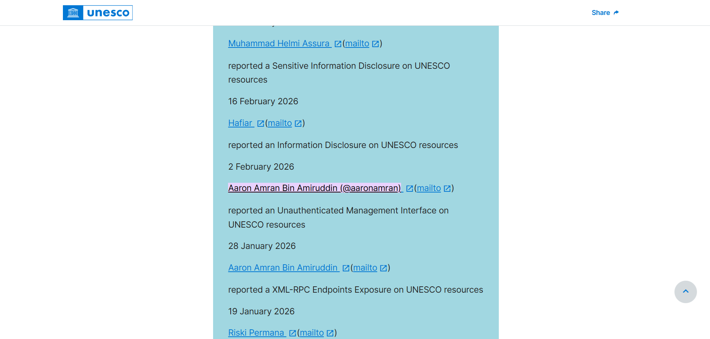

United Nations Educational, Scientific and Cultural Organization (UNESCO)

<h1 class="writeup-title">UNESCO's Unprotected Power Supply in Ecuador</h1>

March 2026 &mdash; Vulnerability Disclosure Program

This was my second attempt at reporting a vulnerability to UNESCO, following <a href="./unesco-vdp-writeup-2026-first.html">my previous article</a>. My goal this time was to identify a more critical finding for their vulnerability disclosure program, so I shifted my strategy from web application testing to reconnaissance of their open network ports.

On the morning of 28 January 2026, I began auditing UNESCO's network infrastructure using Shodan. I searched for <code>org:unesco</code> and navigated to the "Ports" section to review the facet analysis of their internet-connected devices. Preferring a manual approach to vulnerability hunting, I personally inspected the open ports and their associated hosts.

One specific port caught my eye because I had never encountered it before: port 502. Opening the Shodan page for this port revealed that it belonged to a device in Ecuador using the Modbus protocol, which is commonly used for industrial control systems. Further details for port 443 showed that the device was running Venus OS by Victron Energy.

When I tried to open port 502 in a web browser, it did not respond like a typical web page. This was expected, as Modbus is not a web-based protocol. I then tried to open port 443, which revealed a web-based interface for a Remote Console on a Local Area Network.

My instincts told me this was a significant finding. The fact that it was accessible over the internet posed a serious security risk, especially since hotkeys for remote control were readily available. To confirm the severity, I opened the Chrome DevTools and reloaded the page to check the HTTP response status.

To my surprise, the DevTools Console states <b>No Auth required</b> and <b>Authentication OK</b>. Recognizing the gravity of this finding, I stopped my interaction immediately and reported it via email to UNESCO's Digital Security team.

I did some Google searches and read some related documentation to better understand the implications of this discovery.

I also used Gemini to clarify what I was looking at, and here are Gemini's responses:

Through this research, I discovered that the device is a remote console for a power supply unit. This means an attacker could potentially gain control over the power supply, causing a power outage or damaging connected equipment. This is a critical vulnerability with severe potential consequences for UNESCO's operations.

I waited until 26 February 2026 to receive confirmation from the Digital Security team. It felt like winning the lottery because I had achieved my goal of discovering a critical vulnerability to be added to my personal records.

I confirmed the fix was successful with a screenshot proof and sent the team the necessary details for my listing in their <a href="https://www.unesco.org/en/vulnerability-disclosure#:~:text=Aaron%20Amran%20Bin%20Amiruddin%20(%40aaronamran)">Cybersecurity Hall of Fame</a>.

<section class="text-center" style="margin-top:1.5rem; margin-bottom:1.5rem;">

See you in the next hack.

@aaronamran

March 2026

</section>

