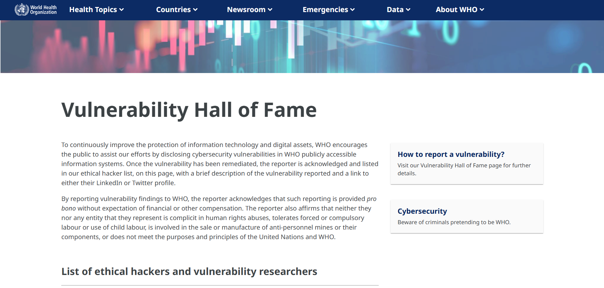
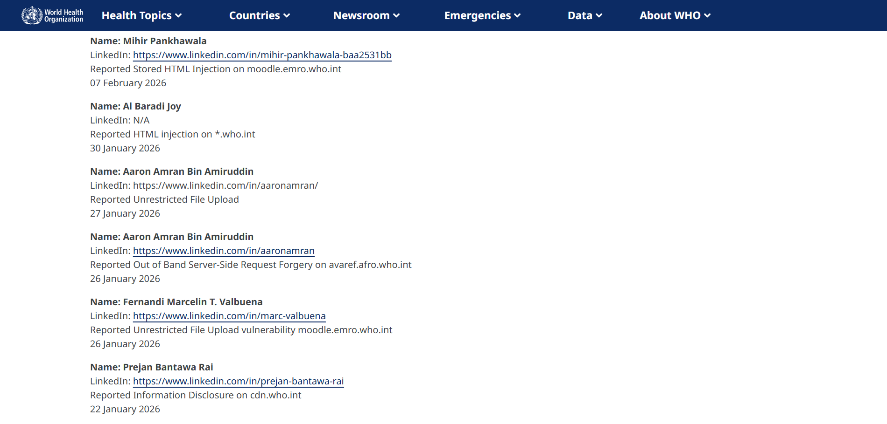

World Health Organization (WHO)

<h1 class="writeup-title">World Health Organization's WordPress Vulnerability</h1>

August 2026 &mdash; Vulnerability Disclosure Program

This is my second VDP win from the World Health Organization. As I mentioned in my <a href="/ethicalhacking/who-vdp-writeup-2026-first/" target="_blank" rel="noopener noreferrer">first post</a>, I first came across the WHO Vulnerability Hall of Fame around September 2024. Back then, I was a complete beginner, always amazed by how people could discover vulnerabilities and have their names celebrated as heroes. I set my sights on that goal and kept it in the back of my mind until fate reminded me to just jump straight in rather than waiting for the "right day" to arrive.

Since I have reported this vulnerability involving the ArcGIS FeatureServer multiple times for other organizations, I won't repeat the full step-by-step process here (mostly because I am too lazy to write it all out again). You can check my previous posts for those details. However, I will share a screenshot of the Google Dork I used during reconnaissance that led to this discovery:

After demonstrating the vulnerability with a safe PoC, I submitted my report to the WHO Information Security team on 27 January 2026. They responded on 30 January 2026 with the following message:

After months of waiting, they finally added my name to the Hall of Fame in August. I am not sure of the exact date, but I discovered my name was credited on 18 August 2026.

<section class="text-center" style="margin-top:1.5rem; margin-bottom:1.5rem;">

See you in the next hack.

@aaronamran

August 2026

</section>

